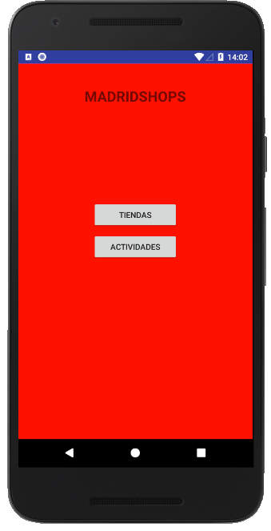
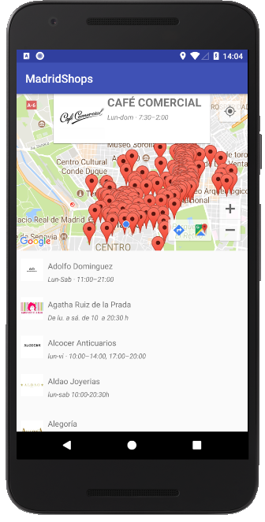
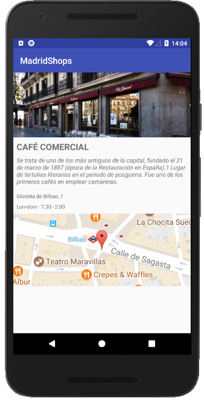

# Android-Avanzanced practice

Create a mobile application to display information of Shops in Madrid, even when the user has no Internet connection. Shops should be shown in a Map.

## Table of contents
- [Requirements](#requirements)
- [Extra requirements](#extrarequirements)
- [Web services](#webservices)
- [Technologies](#technologies)
- [Extra Features](#extrafeatures)

Main | ShopList | ShopDetail
---- | -------- | ----------
 |  | 

## Requirements

1. When starting the App for the first time, if there's Internet connection it will download all information from the Shops access point (see below), including all images.
2. The App will cache everything locally: images, data, etc. Even images of the maps.
3. Cache is never invalidated, so once everything has been saved, set a flag and never ever access to the network again.
4. If there's no Internet connection a message will be shown to the user.
5. While caching the App will show an Activity indicator or other loader. Until you finish caching you don't get to the Main menu.
6. The app will have a main menu screen where we'll add one button & a logo. The button takes us to the list of shops.
7. The list of Shops will show in the upper 50% screen a map with one pin for each shop.
8. The list of Shops will show in the lower 50% screen. Logo to the left, background image taking all the row, shop name in the front. Tapping a row takes us to the detail shop screen.
9. All info should be read from a sqlite database.
10. If you tap on a pin in the map a callout will open.
shop name. Taping the callout takes us to the detail shop screen.
11. The map will be always centered in madrid, showing also the user location.
12. All data is at least in Spanish & English: should cache all and display in Spanish (if that's our phone's language) or English otherwise.
13. Shop detail screen should show shop name, description, address, and a map showing the shops's location without any pin.

## Extra Requirements
1. Use a git repository to track your code as you go along.
2. To persist information while you're offline use sqlite.
3. You can cache the images using any technique you like.
4. Clean architecture would be nice: interactors, managers, etc.
5. Test: model, DAOs.

## Web services
URL MapCache API
>"https://maps.googleapis.com/maps/api/staticmap?%25&size=320x220&scale=2&markers="

[URL Shops API](https://madrid-shops.com/json_new/getShops.php)

[URL Activities API](https://madrid-shops.com/json_new/getActivities.php)

## Technologies
* Android Studio 3.0.1
* Kotlin
* Sqlite
* GoogleMaps
* [Picasso](http://square.github.io/picasso/)

## Extra Features
* ***Show User Location Button:*** this button show the user location and center the map on him until button is pressed again. Thanks GoogleMaps!
* ***Scroll View:*** a scroll view to show all shop details.
* ***Reload button:*** a reload button appears when conexion or download fails. This button reload all data again.